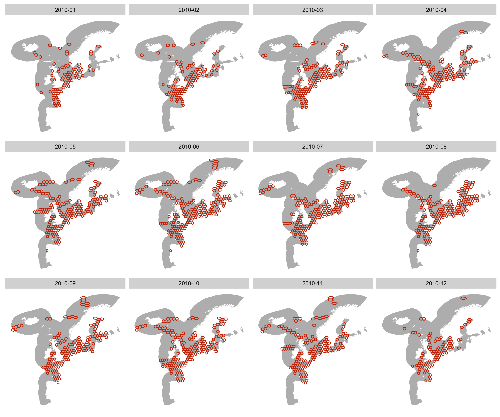
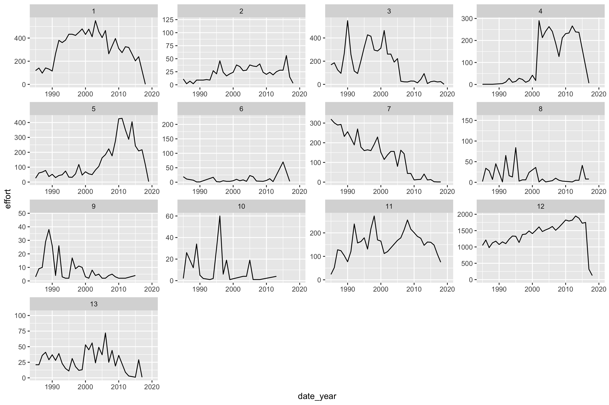
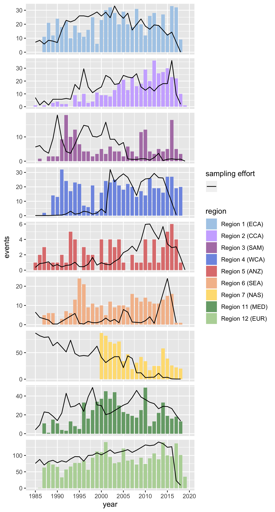

## Correcting sampling HAEDAT event trends using sampling effort inferred from OBIS occurrence data

The following approach was followed to estimate sampling effort from OBIS data:

- Around 7 million phytoplankton records were extracted from OBIS.
- The occurrence records were matched with the HAEDAT regions using shapefiles downloaded from https://github.com/iobis/hab-regions.
- A hexagonal discrete global grid was constructed using https://github.com/r-barnes/dggridR.
- Within each region and each month, the number of grid cells with phytoplankton records was counted. The resulting numbers were summed per year to obtain an estimate of sampling effort for thar year.

For example. The figure below shows the grid cells with phytoplankton data for each month of 2010 in region 12 (Europe). The sampling effort estimate for 2010 corresponds to the total number of cells in the figure.

This resulted in the following trends of sampling effort per region:

The following figure shows the sampling effort superimposed on the numbers of HAEDAT events per region:

